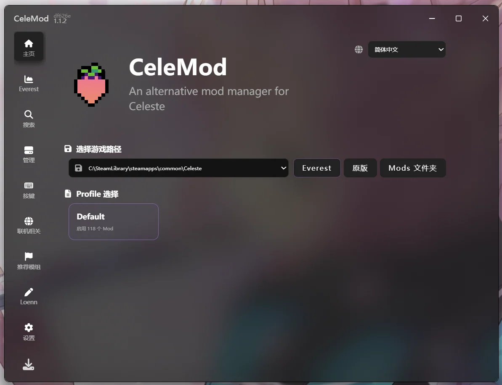
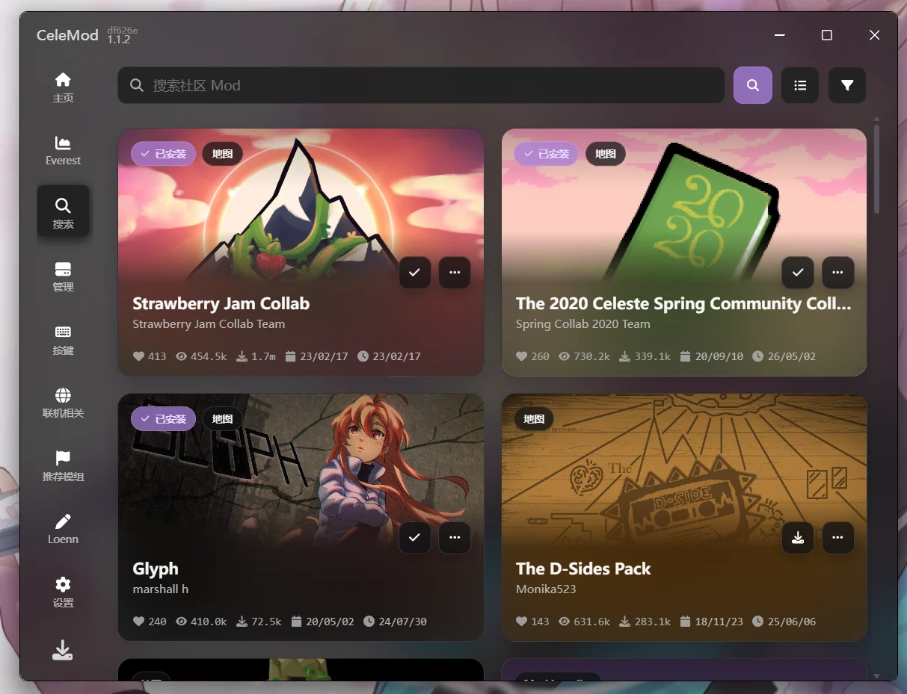
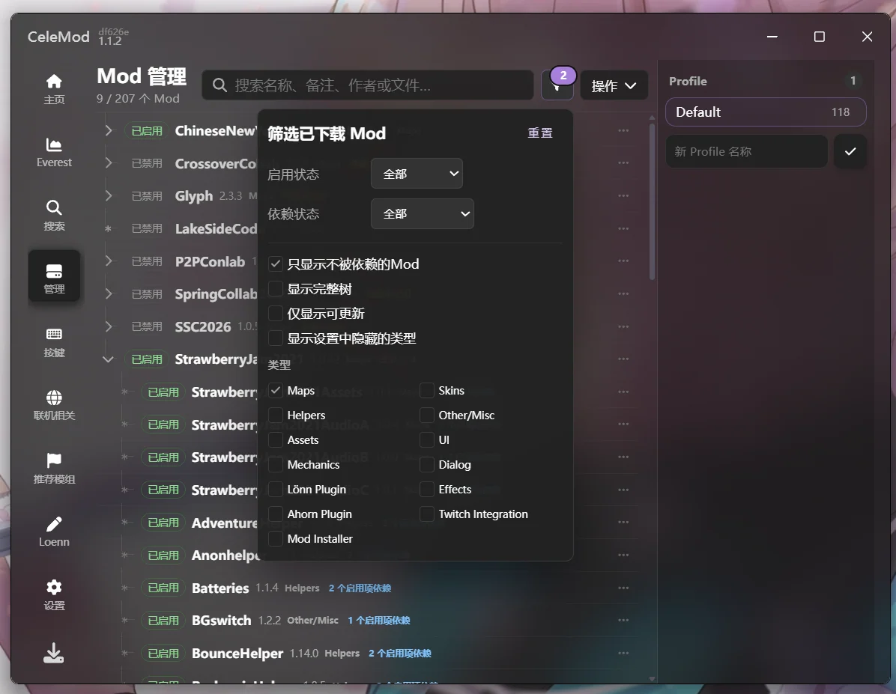
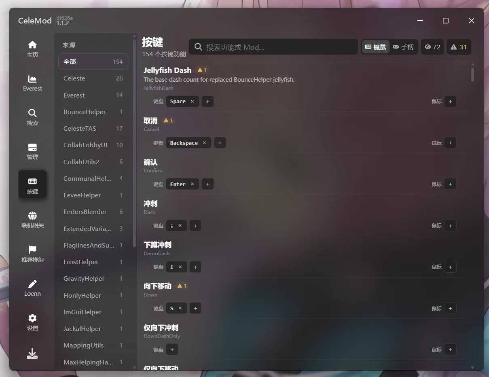
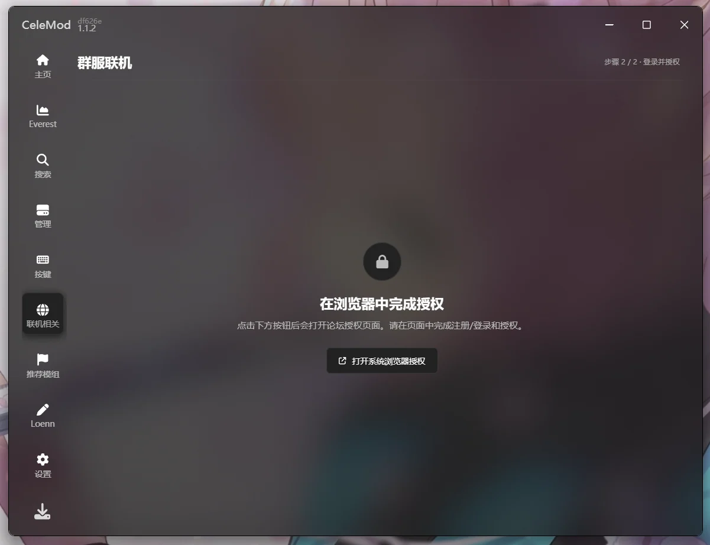
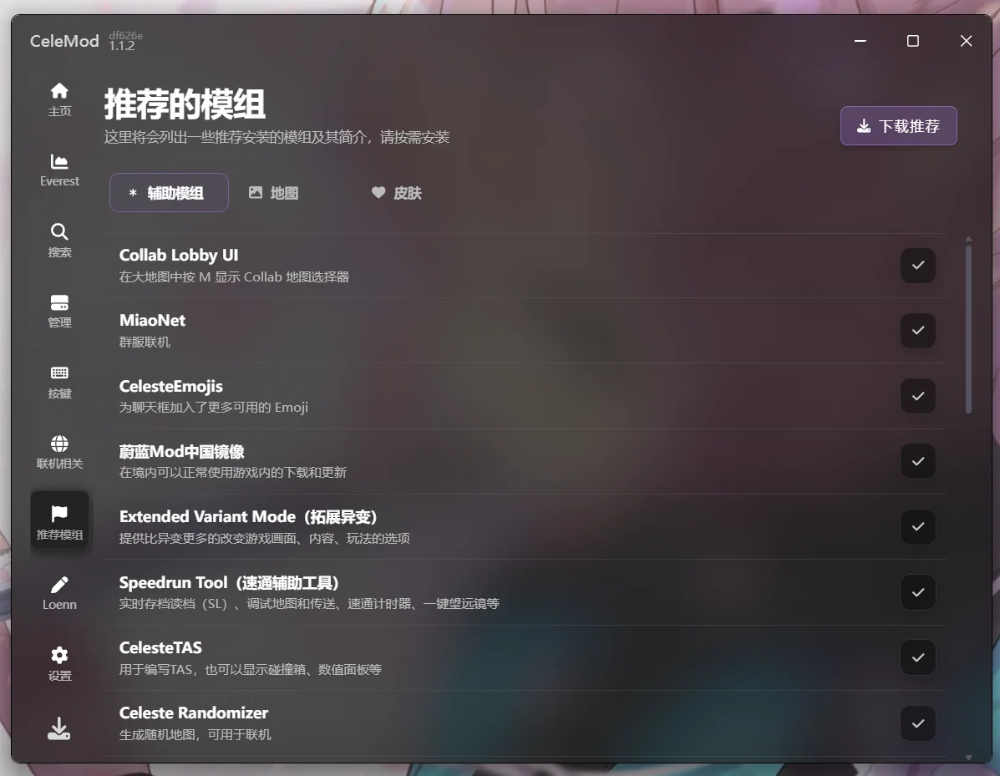
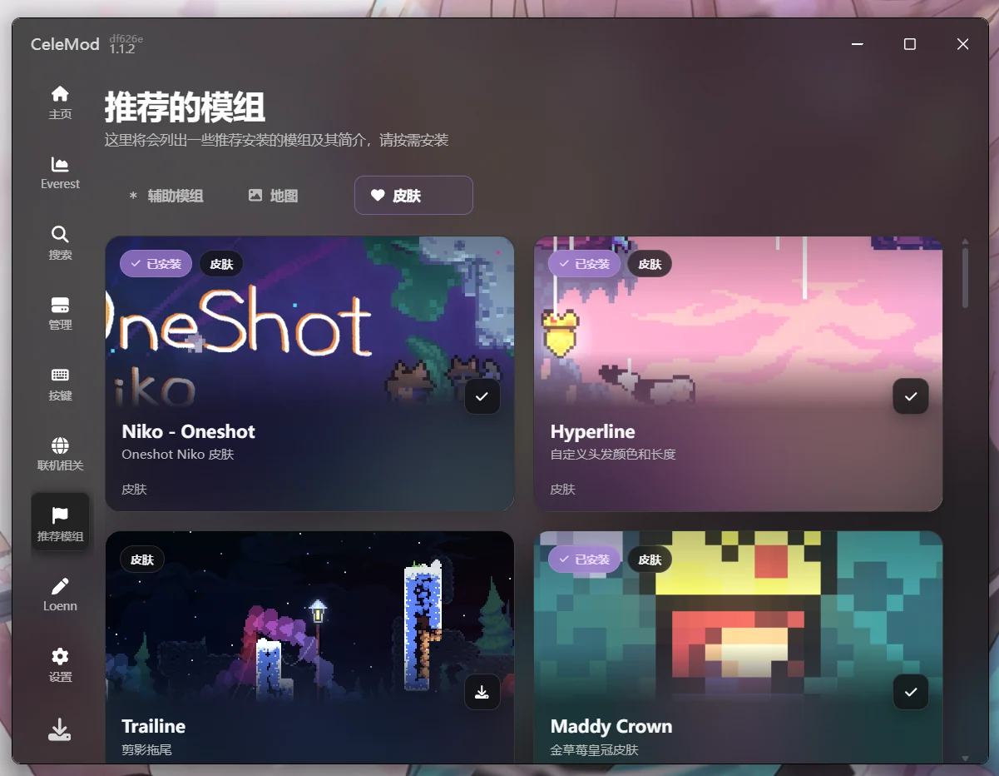
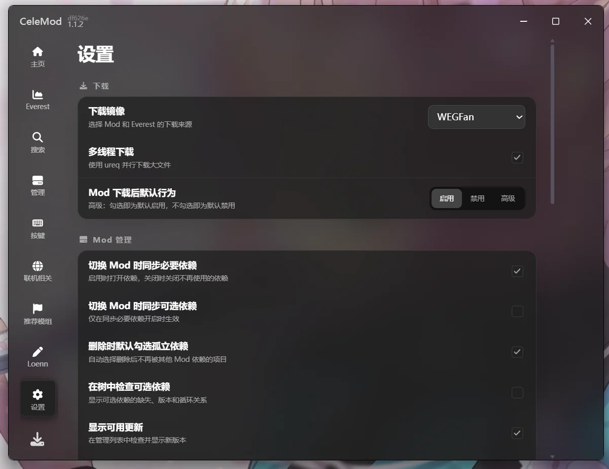

<div align=center>


# CeleMod

[Github Releases](https://github.com/MicroCBer/CeleMod/releases/latest)

An alternative mod manager for Celeste

</div>

### Easy to use

✅ List of commonly used Mods, one-click installation  
✅ Super-fast download (multi-threaded download, @WEGFan mirror)  
✅ Cross-platform desktop app powered by Tauri 2
✅ One-click analysis and dependency completion  
✅ One-click upgrade Mod  
✅ Search by category, multiple sorting methods  
✅ Everest mirror one-click installation

### Powerful

✅ Multiple Mod configurations can be switched with one click  
✅ Tree-like Mod management, dependencies are clear at a glance  
✅ Multiple Mods can be downloaded at the same time without blocking  
✅ Mod details preview in the software  
✅ Native WebView + React UI

### Screenshots

<table>
  <tr>
    <td><br /><b>Home and profiles</b></td>
    <td><br /><b>Community search</b></td>
  </tr>
  <tr>
    <td><br /><b>Tree-based management</b></td>
    <td><br /><b>Keybinding manager</b></td>
  </tr>
  <tr>
    <td><br /><b>Multiplayer setup</b></td>
    <td><br /><b>Recommended mods</b></td>
  </tr>
  <tr>
    <td><br /><b>Skin browser</b></td>
    <td><br /><b>Complete settings</b></td>
  </tr>
</table>

### Credits

[@WEGFan](https://github.com/WEGFan) provides mirroring and community API, Celeste implementation and other related knowledge

@Destro and @Rhuan Brazilian Portuguese translation

[@dzhake](https://github.com/dzhake) Russian translation

### Development

CeleMod uses Tauri 2, React, Zustand, and Immer. Install Node.js 20+, pnpm, Rust nightly, and the [Tauri prerequisites](https://v2.tauri.app/start/prerequisites/) for your platform.

```bash
pnpm --dir src/celemod-ui install
pnpm --dir src/celemod-ui tauri dev
```

Run the frontend checks and build the desktop bundle with:

```bash
pnpm --dir src/celemod-ui typecheck
pnpm --dir src/celemod-ui build
pnpm --dir src/celemod-ui tauri build
```
